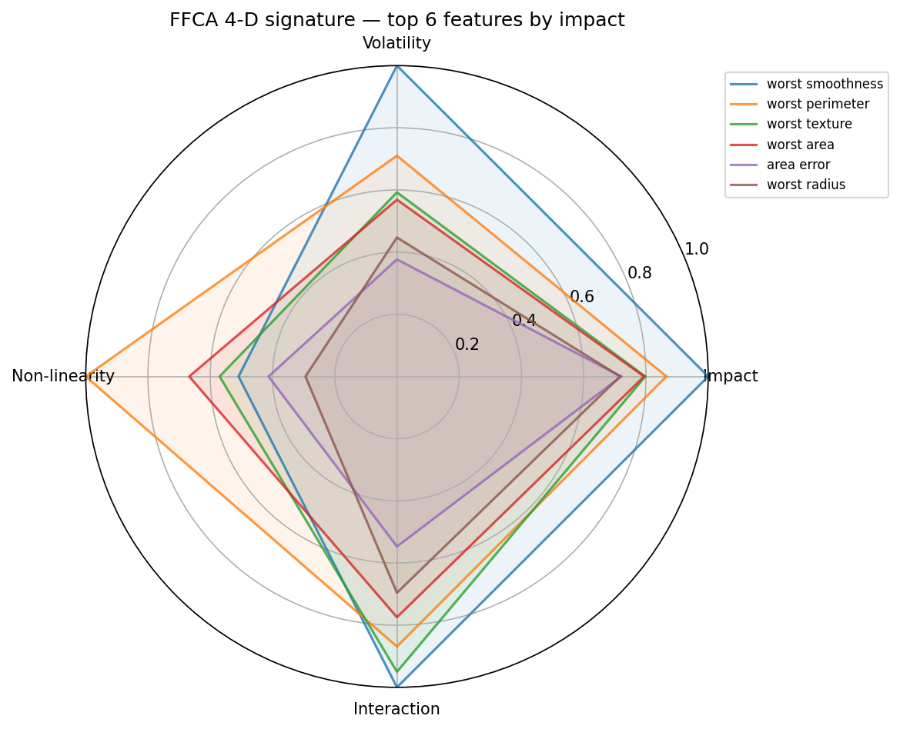
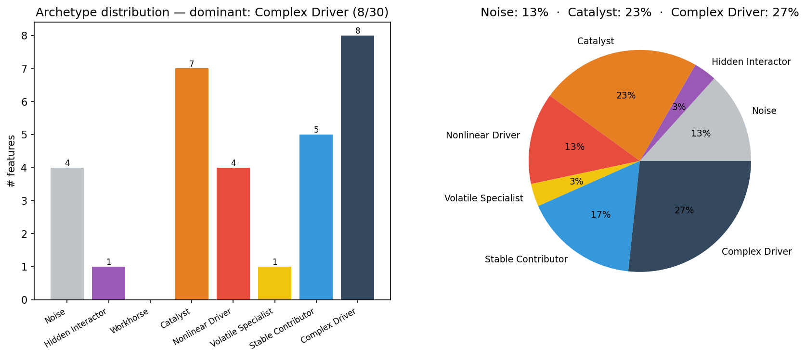
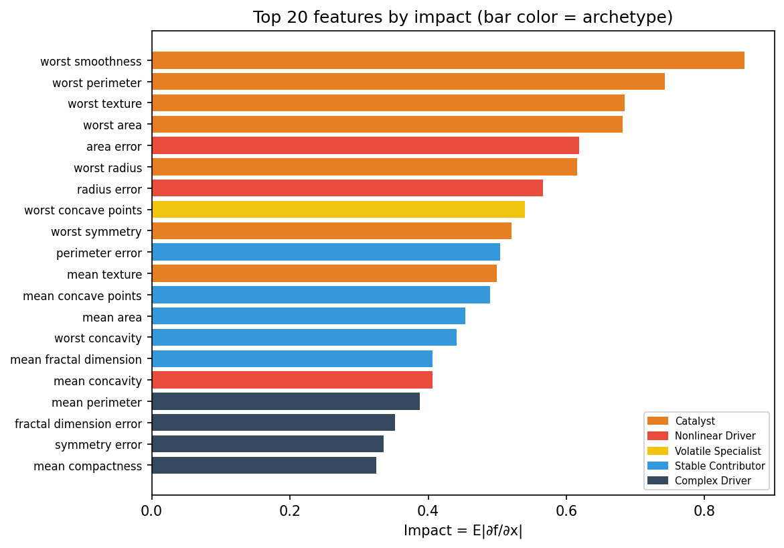
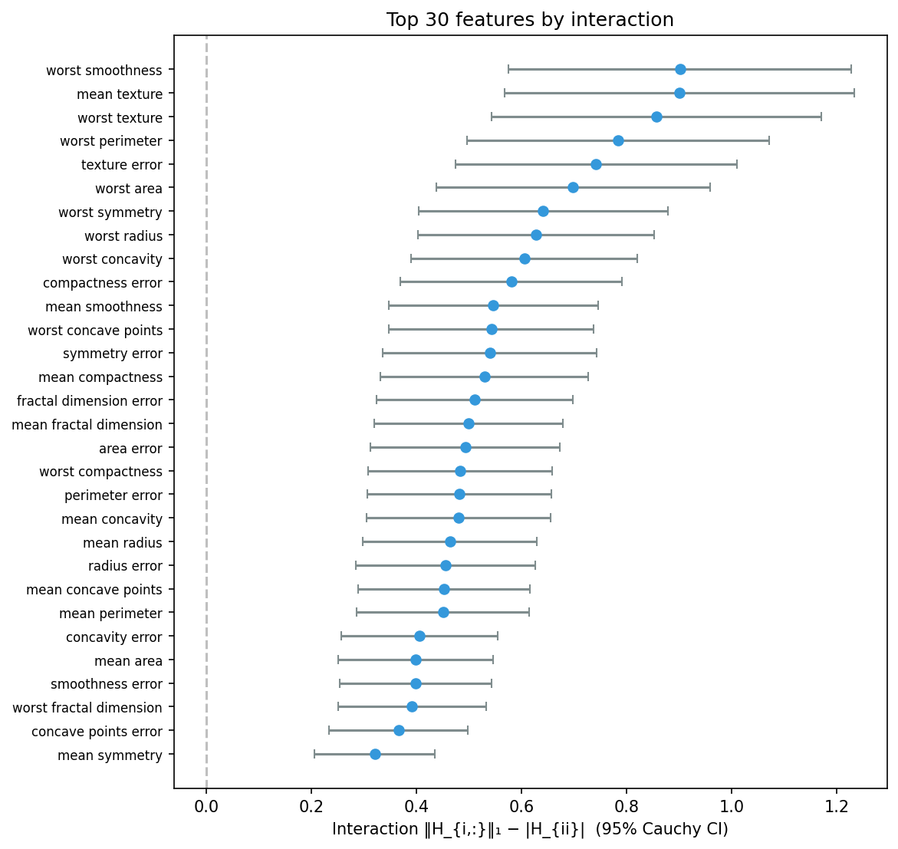
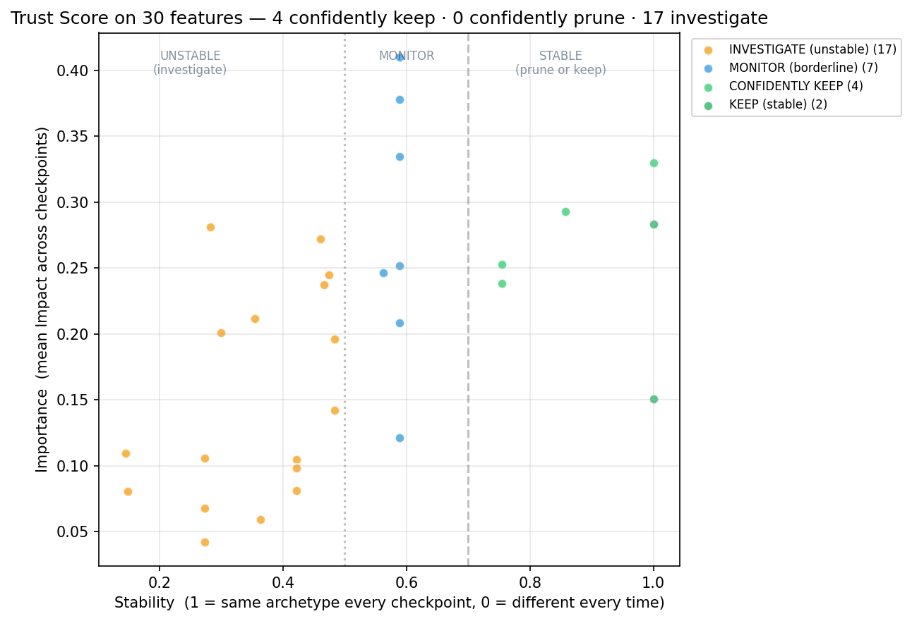
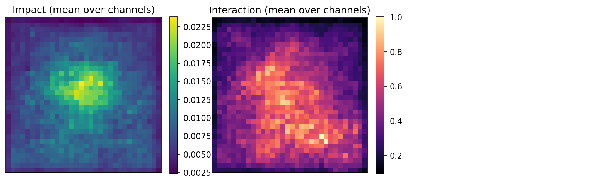
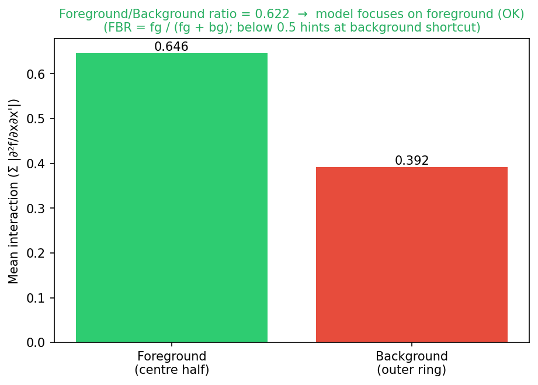
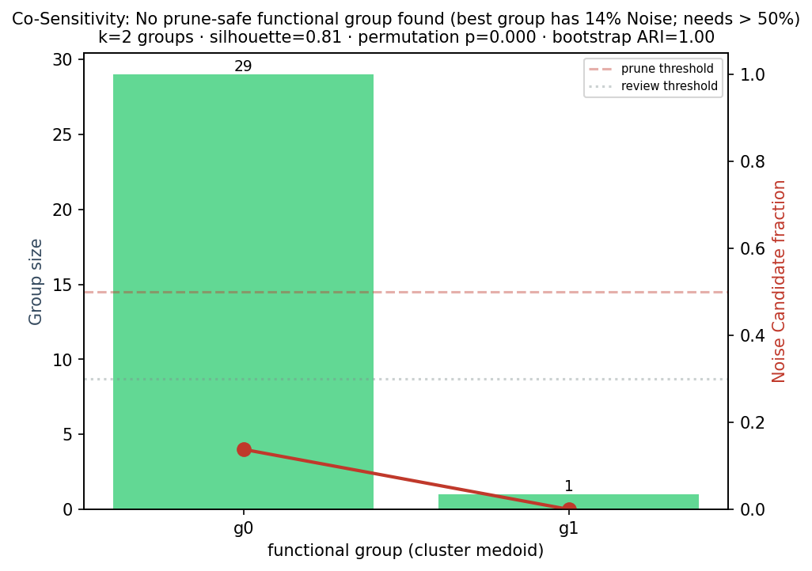

# FFCA

[](https://pypi.org/project/ffca/)
[](LICENSE)
[](https://www.python.org/)

**Feature-Function Curvature Analysis (FFCA)** — universal explainability for
any differentiable PyTorch model. Compute a 4-D feature signature
(*Impact, Volatility, Non-linearity, Interaction*), classify each feature into
one of 8 archetypes, and detect overfitting, data leakage, shortcut learning,
and unstable feature roles — from a single model + DataLoader (and optionally
a list of training checkpoints).

> One adapter, one report, every architecture: MLPs, CNNs, GPT-2/BERT
> embeddings, attention heads, super-resolution networks — all from the
> same primitives.

---

## Install

```bash
pip install ffca                            # core: tabular FFCA
pip install "ffca[image]"                   # +torchvision for pixel/channel FFCA
pip install "ffca[netcdf]"                  # +xarray for scientific NetCDF data
```

> Note: the PyPI distribution is named **`ffca`**, the import name is also
> `ffca`, and the CLI binary remains **`ffca-report`** (kept for backward
> compatibility with scripts).

## 30-second quickstart

Pick the adapter that matches your data:

<details open><summary><b>Tabular (MLP / tabular transformer)</b></summary>

```python
from ffca import FFCAReport, TabularAdapter, CheckpointLoader

adapter = TabularAdapter(model, feature_names=column_names)
report = FFCAReport(adapter, val_loader).run(
    checkpoints=CheckpointLoader(model_factory, ["e1.pt", "e10.pt", "e50.pt"]),
)
report.save("out/")
# → out/report.md, out/report.json, out/plots/{01_signature_radar, …}.png
```
</details>

<details><summary><b>Pixel-level FFCA on a CNN (Waterbirds-style)</b></summary>

```python
from ffca import FFCAReport, PixelAdapter

adapter = PixelAdapter(model, input_shape=(3, 224, 224))
FFCAReport(adapter, val_loader).run().save("out/")
```
</details>

<details><summary><b>Channel-level FFCA on an intermediate CNN layer</b></summary>

```python
from ffca import FFCAReport, ChannelAdapter

adapter = ChannelAdapter(model, layer_name="layer4.2.conv2")
FFCAReport(adapter, val_loader).run().save("out/")
```
</details>

<details><summary><b>Transformer embedding or attention head (distilgpt2, BERT, LLaMA)</b></summary>

```python
from ffca import FFCAReport, TransformerEmbeddingAdapter

adapter = TransformerEmbeddingAdapter(hf_model)  # auto-locates wte/word_embeddings
FFCAReport(adapter, hf_loader).run().save("out/")
```
</details>

## 30-second CLI

```bash
ffca-report \
  --model-class my_package.models:MyMLP \
  --weights ckpt/final.pt \
  --adapter tabular \
  --data data.csv \
  --out reports/run-1/
```

Channel-level FFCA over multiple checkpoints (the recipe behind the CIFAR-10
validation run shipped with this repo):

```bash
ffca-report \
  --model-class torchvision.models:resnet50 \
  --weights ckpt/final.pt \
  --checkpoints ckpt/e10.pt ckpt/e50.pt ckpt/final.pt \
  --adapter channel --layer layer4.2.conv2 \
  --data data/imagenet_val/ --image-size 224 \
  --out reports/resnet50-run/
```

Run on NetCDF or `.npy` data — useful for scientific workflows
(climate, SR, simulation):

```bash
ffca-report \
  --model-class my_pkg.models:SRDRN --weights srdrn.pt \
  --adapter channel --layer encoder.block4 \
  --data climate.nc --data-format netcdf \
  --data-channels precip,temp,humidity \
  --target-column rainfall \
  --out reports/climate-run/
```

`--data-format` accepts `auto | csv | imagefolder | netcdf | npy` —
`auto` (the default) inspects the path.

## How to read the FFCA report

Each `report.save()` writes `report.md`, `report.json`, and a `plots/` folder.
Here's the tour using a real run on the breast-cancer dataset
([`validation_runs/01_tabular/with_improvements/`](validation_runs/01_tabular/with_improvements/)).

### 1. Signature radar — the 4-D fingerprint


One radar per checkpoint — quick visual diff of how the 4 axes evolve.

### 2. Archetype distribution — what kinds of features the model uses


Stacked bar across checkpoints. Look for: a growing **Noise** column late in
training (overfitting); a single archetype dominating (low-capacity, brittle).

### 3. Impact ranking — top features


### 4. Interaction with 95% Cauchy-HVP CIs


Wide CIs ⇒ probe count too low — bump `--n-probes`. Tight CIs ⇒ trust the
ordering.

### 5. Trust Score scatter — keep / monitor / investigate


The two-axis (Stability × Importance) plot used to drive feature-keep /
feature-prune decisions across checkpoints. Each dot is one feature, the
quadrants are the recommendations.

### 6. Pixel-level FFCA → foreground / background diagnostic
For image models, `PixelAdapter` produces an interaction heatmap and the
Foreground / Background Ratio (FBR) — the Waterbirds shortcut-learning
detector:




FBR < 0.5 means more interaction in the *ring* than the centre — the model
is leaning on background cues.

### 7. Co-Sensitivity groups — redundant feature clusters


K-medoids on gradient correlations, with permutation + bootstrap-ARI guards.
The package **refuses** to recommend a prune when statistical evidence is weak
— see the `co_sensitivity` finding below.

## Diagnostic findings catalog

Every run produces a `findings` list in `report.json`. These are the types
you can encounter; each is illustrated with a real headline from the
validation runs shipped in [`validation_runs/`](validation_runs/).

| Finding | Severity | Example headline |
|---|---|---|
| `overfitting` | critical / warn / info | "Volatility grew 12.3× by the final checkpoint" |
| `data_leakage` | warn | "2 feature(s) carry unusually high Impact with low Non-linearity + Interaction — possible leakage" |
| `shortcut_learning` | info / warn | "No background-shortcut signal — Foreground/Background interaction ratio = 0.50" |
| `trust_instability` | warn | "1611/3072 features are unstable across checkpoints" |
| `trust_keep_recommended` | info | "586 features are stably important across all checkpoints" |
| `trust_prune_recommended` | info | "194 features are confidently Noise across all checkpoints" |
| `co_sensitivity` | info | "Co-Sensitivity refused to recommend any prune (2 groups found, but no prune-safe group)" |
| `capacity` | info | "Healthy archetype distribution" |

Each finding carries `headline`, `observation`, `why_it_matters`, and
`recommendation` — they read like a code-review comment, not a numerical
dump.

## What FFCA actually computes

| Axis | Symbol | Definition | What it tells you |
|---|---|---|---|
| Impact | I | E[\|∂f/∂xᵢ\|] | How much does feature *i* move the output? |
| Volatility | V | Var[∂f/∂xᵢ] | Is the effect consistent or context-dependent? |
| Non-linearity | N | E[\|∂²f/∂xᵢ²\|] | Does the relationship curve? |
| Interaction | X | Σⱼ E[\|∂²f/∂xᵢ∂xⱼ\|] | Does feature *i* act through others? |

Classified into 8 archetypes:

| Archetype | High in | Practitioner read |
|---|---|---|
| Noise | nothing | safe to prune (verify with Trust Score) |
| Hidden Interactor | X only | weak alone, strong through interactions |
| Workhorse | I (clean) | linear, reliable, independent |
| Catalyst | I + X | strong + couples with others |
| Nonlinear Driver | I + N | curved, important |
| Volatile Specialist | I + V | strong in some contexts |
| Stable Contributor | I (moderate) | mild but reliable |
| Complex Driver | high everywhere | inspect with the full toolkit |

## The three audit-v2 improvements

Pass `--no-improvements` to fall back to baseline FFCA; the package's
default is "with improvements on". The three additions live in
`ffca/improvements_pkg/` and were re-implemented in v0.1.0a1 after the
[Audit v2 report](reports/AUDIT_V2_REPORT.md) found the earlier versions
broken.

1. **Cauchy-HVP** — `cauchy_hvp.py`. Interaction estimation via Pearlmutter
   HVP with Cauchy(0,1) probes. Median 0.97 Spearman vs the exact Hessian
   at `d=16, B=100`; ~150× wall-clock speedup at `d=12,288`. Validated by
   `tests/test_cauchy_hvp_validation.py`.
2. **Trust Score** — similarity-weighted entropy across checkpoints, with
   a two-axis (Stability × Importance) view per feature. Drives
   `trust_keep_recommended`, `trust_prune_recommended`, and
   `trust_instability` findings.
3. **Co-Sensitivity** — gradient-correlation k-medoids with permutation
   + bootstrap-ARI guardrails. Refuses to recommend a prune when the
   statistical evidence isn't there.

## Universal adapter pattern

Any model the package hasn't seen before gets a ~20-line adapter:

```python
from ffca.core import FFCAModelAdapter

class MyAdapter(FFCAModelAdapter):
    n_features = 768
    feature_shape = (768,)
    feature_names = None  # optional

    def feature_input(self, batch):
        return batch["embeddings"].clone().requires_grad_(True)

    def scalar_output(self, x, batch):
        out = self.model(inputs_embeds=x)
        return out.logits[:, -1].max(dim=1).values.sum()
```

See [`docs/adapters.md`](docs/adapters.md) for the full guide and
[`ffca/adapters/`](ffca/adapters/) for the four shipped ones.

## Built-in adapters (v0.1.0)

| Adapter | Use for | Feature axis |
|---|---|---|
| `TabularAdapter` | MLPs, tabular transformers | input columns |
| `PixelAdapter` | image classifiers | C × H × W pixels |
| `ChannelAdapter` | any CNN — intermediate layer | C channels (mean-pooled) |
| `TransformerEmbeddingAdapter` | HF Transformers — input embeddings | hidden-dim |
| `TransformerHeadAdapter` | HF Transformers — attention heads | n_layers × n_heads |

## Validation runs

[`validation_runs/`](validation_runs/) contains real reports on four
architectures, side-by-side baseline vs with-improvements. Open
`summary.md` in each:

- [`01_tabular/`](validation_runs/01_tabular/) — MLP on breast-cancer
- [`02_cnn/`](validation_runs/02_cnn/) — CIFAR-10 CNN, both pixel and channel
- [`03_srdrn/`](validation_runs/03_srdrn/) — SRDRN super-resolution on real GCM data
- [`04_llm/`](validation_runs/04_llm/) — distilgpt2 embedding + attention head

To regenerate the summary files: `python validation_runs/summarize_validation.py`.

## Roadmap

- v0.2: ResNet/EfficientNet examples; Lightning + HF checkpoint helpers;
  spatial-heatmap polish
- v0.3: Token-level transformer adapter; per-head attribution
- v1.0: VAE / diffusion / GNN adapters; Sphinx docs

## Citation

If you use FFCA, please cite:

```bibtex
@article{najafi2025ffca,
  title  = {Feature-Function Curvature Analysis: A Geometric Framework
            for Explaining Differentiable Models},
  author = {Najafi, Hamed and Luo, Dingding and Liu, Jason},
  journal= {arXiv preprint arXiv:2510.27207},
  year   = {2025}
}
```

## License

MIT — see [LICENSE](LICENSE).
